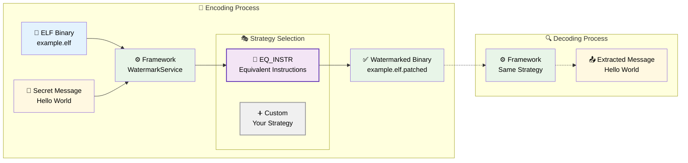

# 🔐 ELF Watermarking Framework

A comprehensive framework for embedding and extracting hidden messages in ELF binary files using multiple watermarking strategies.

## 🎯 How It Works



## 🚀 Quick Start

```bash
# Install dependencies
poetry install

# Install the framework
pip install .

# Example usage
watermark example.elf -e secret -s EQ_INSTR
# Encoding successful. Modified binary saved to ./example.elf.patched 
watermark example.elf.patched -d -s EQ_INSTR
# Decoded message: secret
```

## 📚 Documentation

- **[📖 Complete Documentation](./docs/README.md)** - Start here for comprehensive guides
- **[🏗️ Architecture Overview](./docs/architecture/Architecture.md)** - Framework design and components  
- **[🔧 How to Implement a Watermarker](./docs/HowToWatermarker.md)** - Developer guide for custom strategies
- **[🔄 Architecture Rework Report](./docs/architecture/ArchRework.md)** - Migration from old to new design

## ✨ Features

- **Multi-Architecture Support**: Easy to adapt for different ELF architectures
- **Extensible Design**: Easy to add new watermarking algorithms
- **Strategy Pattern**: Clean separation between framework core and watermarking logic
- **CLI & Library Interface**: Use from command line or integrate into Python projects

## 🛠️ Built With

- **Python 3.11+** - Core framework
- **Capstone** - Disassembly engine
- **PyELFTools** - ELF file parsing

## 📋 Project Structure

```
watermark_framework/
├── __init__.py          # Main exports
├── core/               # Core service layer
├── io/                 # ELF file handling
├── watermarkers/       # Watermarking strategies
├── cli/                # Command-line interface
└── architecture.py     # Architecture definitions
```

## 🤝 Contributing

1. Read the [Architecture Documentation](./docs/architecture/Architecture.md) to understand the framework
2. Check the [How to Implement a Watermarker](./docs/HowToWatermarker.md) guide for adding new strategies
3. Follow the existing code patterns and documentation standards
