# 🔧 How to Implement a Watermarker

In our watermarking framework, a watermarker is a class responsible for defining the strategy to encode and decode hidden messages within the `.text` section of ELF binaries.

This guide provides detailed instructions for implementing and integrating a new watermarker into the framework.

## 🎯 Watermarker Implementation Flow

```mermaid
graph TD
    A[📋 Create New Class] --> B[⚙️ Implement Methods]
    B --> C[🏷️ Set Attributes]
    C --> D[🔧 Architecture Support]
    
    B --> B1["encode()"]
    B --> B2["decode()"]
    B --> B3["get_nbits()"]
    
    C --> C1[METHOD_NAME]
    C --> C2[SUPPORTED_ARCHS]
    
    D --> D1[Simple if-else<br/>2-3 Architectures]
    D --> D2[Handler Registry<br/>5+ Architectures]
    
    style A fill:#e1f5fe
    style B fill:#f3e5f5
    style C fill:#e8f5e8
    style D fill:#fff3e0
```



## 📋 Prerequisites

Before starting, ensure you have:

- A solid understanding of Python programming
- Familiarity with the project's architecture, particularly the [`WatermarkService`](../watermark_framework/core/service.py) and [`Watermarker` interface](../watermark_framework/watermarkers/interface.py)
- Basic knowledge of ELF binaries and disassembly concepts

> [!TIP]
> Review the [Architecture documentation](./architecture/Architecture.md) to understand the overall framework design before implementing your watermarker.

## 🏗️ Framework Component Relationships

```mermaid
graph TD
    subgraph "Your Implementation"
        YW[Your Watermarker<br/>📝 Custom Logic]
    end
    
    subgraph "Framework Core"
        WS[WatermarkService<br/>🎯 Context Class]
        TSH[TextSectionHandler<br/>📄 ELF I/O Manager]
        TS[TextSection<br/>📦 Data Container]
    end
    
    subgraph "Data Flow"
        ELF[ELF Binary<br/>🗂️ Input File]
        OUTPUT[Modified Binary<br/>✅ Output File]
    end
    
    ELF --> WS
    TSH --> TS
    TS --> YW
    YW --> WS
    WS --> TSH
    TSH --> OUTPUT
    
    style YW fill:#ffcccb
    style WS fill:#add8e6
    style TSH fill:#98fb98
    style TS fill:#f0e68c
    style ELF fill:#d3d3d3
    style OUTPUT fill:#90ee90
```



## 🚀 Step 1: Create a New Class

1. Navigate to the [`watermark_framework/watermarkers/`](../watermark_framework/watermarkers/) directory in the project
2. Create a new Python file for your watermarker, e.g., `my_watermarker.py`
3. Define a class that inherits from the [`Watermarker` interface](../watermark_framework/watermarkers/interface.py):

```python
from watermark_framework.watermarkers.interface import Watermarker

class MyWatermarker(Watermarker):
    pass
```

This class will serve as the foundation for your custom watermarking logic.

## ⚙️ Step 2: Implement Required Methods

Your watermarker must implement the following three methods defined by the [`Watermarker` interface](../watermark_framework/watermarkers/interface.py):

### `encode(self, section: TextSection, message: bytes) -> bytes`

This method encodes the provided message (in bytes) into the `.text` section represented by the [`TextSection`](../watermark_framework/io/section_handler.py) object. It should return the modified `.text` section data as bytes.

- **Input**: `section` provides access to disassembled instructions (`section.insns`) and raw data (`section.data`)
- **Output**: The modified `.text` section data with the message embedded

### `decode(self, section: TextSection) -> bytes`

This method extracts and returns the hidden message from the `.text` section provided in `section`.

- **Input**: The [`TextSection`](../watermark_framework/io/section_handler.py) object containing the watermarked `.text` section
- **Output**: The decoded message in bytes

### `get_nbits(self, section: TextSection) -> int`

This method calculates and returns the number of bits that can be encoded in the given `.text` section, indicating the watermarking capacity.

- **Input**: The [`TextSection`](../watermark_framework/io/section_handler.py) object
- **Output**: An integer representing the available bit capacity

Here's an example with placeholder implementations:

```python
def encode(self, section: TextSection, message: bytes) -> bytes:
    # Implement your encoding logic here
    # Example: Modify section.data based on message
    return section.data  # Return modified data

def decode(self, section: TextSection) -> bytes:
    # Implement your decoding logic here
    # Example: Extract message from section.data
    return b""  # Return extracted message

def get_nbits(self, section: TextSection) -> int:
    # Implement capacity calculation here
    # Example: Analyze section.insns or section.data
    return 0  # Return bit capacity
```

## 🔄 Method Call Flow


## 🏷️ Step 3: Set Class Attributes

Define the following required class attributes to identify and configure your watermarker:

- **`METHOD_NAME`**: A unique string identifier for your watermarker (e.g., `"my_strategy"`). This is used by the framework to recognize and select your watermarker
- **`SUPPORTED_ARCHS`**: A set of architectures your watermarker supports, using the [`Architecture`](../watermark_framework/architecture.py) enum (e.g., `{Architecture.RISCV64}`)

Example:

```python
from watermark_framework.architecture import Architecture

class MyWatermarker(Watermarker):
    METHOD_NAME = "my_strategy"
    SUPPORTED_ARCHS = {Architecture.RISCV64}

    # Method implementations go here
    def encode(self, section: TextSection, message: bytes) -> bytes:
        return section.data

    def decode(self, section: TextSection) -> bytes:
        return b""

    def get_nbits(self, section: TextSection) -> int:
        return 0
```

> [!NOTE]
> The framework uses dynamic discovery, so as long as your class is a subclass of [`Watermarker`](../watermark_framework/watermarkers/interface.py) and resides in the [`watermarkers/`](../watermark_framework/watermarkers/) directory, it will be automatically detected—no additional registration is needed.

## 📦 Data Conventions

> [!IMPORTANT]
>
> - The framework has already checked for capacity before calling your methods
> - All messages are passed as `bytes` objects only

## 🏗️ Supporting Multiple Architectures

Here we present our recommendations for how to implement support for multiple architectures in a watermarking strategy.

Of course you can just write huge switch-case statements, but that is not the best practice and because of that we provide our design guidelines.

> [!IMPORTANT]
> As developers of the framework we **GUARANTEE that only supported architectures will be passed to the Watermarker** class. So you can safely omit the check for unsupported architectures in your code.

### Option 1: Simple if-else for 2-3 Architectures

For strategies that only need to support a small number of architectures (e.g., RISCV64 and X86_64), we can avoid registries altogether and implement the logic directly in the Watermarker class using if-else statements. This is the simplest possible approach because it requires no additional classes or mappings.

```python
# watermark_framework/watermarkers/eq_instr/common.py
from watermark_framework.watermarkers.interface import Watermarker
from watermark_framework.architecture import Architecture

class EquivalentInstructionWatermarker(Watermarker):
    METHOD_NAME = "eq_instr"
    SUPPORTED_ARCHS = {Architecture.RISCV64, Architecture.X86_64}

    def __init__(self, equivalent_instructions=None):
        self._equiv_insns = equivalent_instructions

    def get_nbits(self, section):
        equiv_insns = self._equiv_insns or get_default_insns(section.arch)
        if section.arch == Architecture.RISCV64:
            # RISC-V-specific logic
        elif section.arch == Architecture.X86_64:
            # x86-specific logic

    def encode(self, section, message):
        equiv_insns = self._equiv_insns or get_default_insns(section.arch)
        if section.arch == Architecture.RISCV64:
            # RISC-V-specific encoding
        elif section.arch == Architecture.X86_64:
            # x86-specific encoding

    def decode(self, section):
        equiv_insns = self._equiv_insns or get_default_insns(section.arch)
        if section.arch == Architecture.RISCV64:
            # RISC-V-specific decoding
        elif section.arch == Architecture.X86_64:
            # x86-specific decoding
```

### Option 2: Handler Class Registry for 5-6+ Architectures

> [!NOTE]
> This case is less likely to occur in current state of the project, but it is worth mentioning.

For strategies that need to support many architectures (e.g., RISCV64, X86_64, ARM64, and more), we can use a **handler class-based registry**.

- Each architecture has a dedicated handler class that encapsulates its specific logic
- The Watermarker class maintains a dictionary mapping architectures to these handler classes and delegates method calls to the appropriate handler

```python
# watermark_framework/watermarkers/eq_instr/handlers.py
from watermark_framework.architecture import Architecture
from watermark_framework.watermarkers.interface import BaseHandler

class RiscvHandler(BaseHandler):
    def __init__(self, equiv_insns):
        self.equiv_insns = equiv_insns

    def get_nbits(self, section):
        # RISC-V-specific logic

    def encode(self, section, message):
        # RISC-V-specific encoding

    def decode(self, section):
        # RISC-V-specific decoding

class X86Handler(BaseHandler):
    def __init__(self, equiv_insns):
        self.equiv_insns = equiv_insns

    def get_nbits(self, section):
        # x86-specific logic

    def encode(self, section, message):
        # x86-specific encoding

    def decode(self, section):
        # x86-specific decoding
```

```python
# watermark_framework/watermarkers/eq_instr/common.py
from watermark_framework.watermarkers.interface import Watermarker
from watermark_framework.architecture import Architecture
from .handlers import RiscvHandler, X86Handler

class EquivalentInstructionWatermarker(Watermarker):
    METHOD_NAME = "eq_instr"
    _ARCH_HANDLERS = {
        Architecture.RISCV64: RiscvHandler,
        Architecture.X86_64: X86Handler,
    }
    SUPPORTED_ARCHS = set(_ARCH_HANDLERS)

    def __init__(self, equivalent_instructions=None):
        self._handlers = {
            arch: handler(equivalent_instructions or get_default_insns(arch))
            for arch, handler in self._ARCH_HANDLERS.items()
        }

    def get_nbits(self, section):
        handler = self._handlers.get(section.arch)
        return handler.get_nbits(section)

    def encode(self, section, message):
        handler = self._handlers.get(section.arch)
        return handler.encode(section, message)

    def decode(self, section):
        handler = self._handlers.get(section.arch)
        return handler.decode(section)
```

In this example we have a class-level dictionary `_ARCH_HANDLERS`:

```python
_ARCH_HANDLERS = {
    Architecture.RISCV64: RiscvHandler,
    Architecture.X86_64: X86Handler,
}
```

In `EquivalentInstructionWatermarker` constructor we create a dictionary of handlers for each architecture:

```python
def __init__(self, equivalent_instructions=None):
    self._handlers = {
        arch: handler(equivalent_instructions or get_default_insns(arch))
        for arch, handler in self._ARCH_HANDLERS.items()
    }
```

> [!NOTE]
> `get_default_insns(arch)` is assumed to be a function (not shown in the code snippet) that returns default equivalent instructions for the given architecture. It is special for this example strategy and is not part of the guideline.

The resulting `self._handlers` dictionary will look like this:

```python
{
    Architecture.RISCV64: <RiscvHandler instance>,
    Architecture.X86_64: <X86Handler instance>,
}
```
