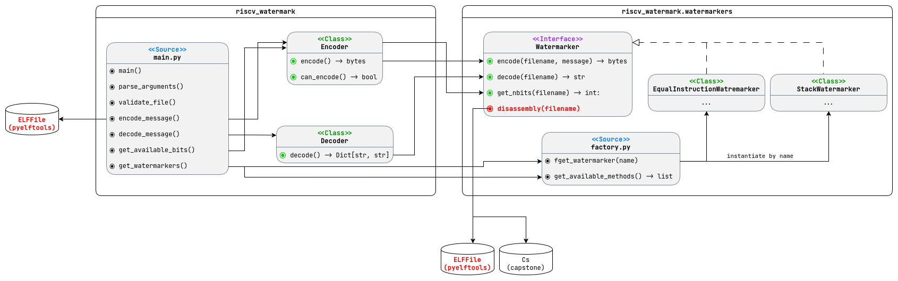

```text
THIS IS DRAFT DOCUMENT
Later it will be moved to the main documentation
```

# Architecture Rework Report

This is the report about deep rework done on project architecture to make it more extensible and maintainable.

## Previous Architecture

You can overview the previous architecture class diagram in the following image:


This UML was done using draw.io and is stored and can be accesed [here](./drawio/Watermark_old.drawio).

## Main Problems of Previous Architecture

- Leaky, Round-about Data Flow.
  - We are passing the filename around, and then re-opening and re-computing same values in multiple places.
  - `main.py / encode_message()`: **opens** the ELF, reads the raw `.text` and even computes `text_addr`.
  - Then we are calling `Encoder.encode()`, which in turn calls `Watermarker.encode(filename,…)`.
  - Watermarker **opens** that same ELF, disassembles `.text` via its `disassembly()` helper.

- No First-Class _Text Section_ Object
  - There is no object that encapsulates "text bytes", offset, Capstone instruction list
  - Instead everyone just passes a filename around and has to re-open or re-compute everything.
  - So we dont have uniform way of providing to watermarker implementation data to work with.

- `disassembly()` method in Watermarker Interface
  - Each specific Watermarker implementation should **only focus on the watermarking algorithm itself**.
  - Including a hard-coded method in the interface, instead of providing already prepared data, is a bad practice.

- Violation of **Separation of Concerns** in `main.py`
  - `main.py` handles:
    - argument parsing (`argparse`),
    - file existence/permission checks,
    - building the `Encoder`/`Decoder`,
    - low-level `ELFFile` calls,
    - writing out the patched ELF,

- No Clear Extension Points
  - New watermarking methods must override all three methods, re-call `super().disassembly()`, and then rebuild byte arrays by hand.
  - There is no clear shared protocol for how to build the watermark.

## Main key changes of the new architecture

- We still use Strategy Pattern, but this design pattern is more clear and easy to understand and use. We define a Context class that plays classic role of the Strategy Pattern, providing seamless connection with Interface and concrete implementations.
- We have a new `TextSection` object that encapsulates the `.text` section of the ELF file. It provides a uniform way to access the disassembly, raw bytes, and offsets.
- The `Watermarker` interface is now more focused on the watermarking algorithm itself. It does not include any hard-coded methods for disassembly or ELF file handling.
- Layered structure provides ability to use framework not only from command line, but also from other Python scripts. Also it provides better Separation of Concerns, moving CLI-only concerns to the CLI layer and IO/Disassembly concerns to the `TextSectionHandler` class.
- We have clear extension points for new watermarking methods. Each method now use the same `TextSection` object, and can easily access the disassembly, raw bytes, and offsets without touching low-level ELF file handling.

More details about the new architecture can be found in the [Architecture](./Architecture.md) document.
