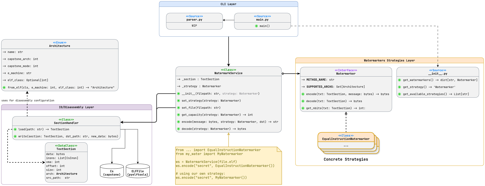
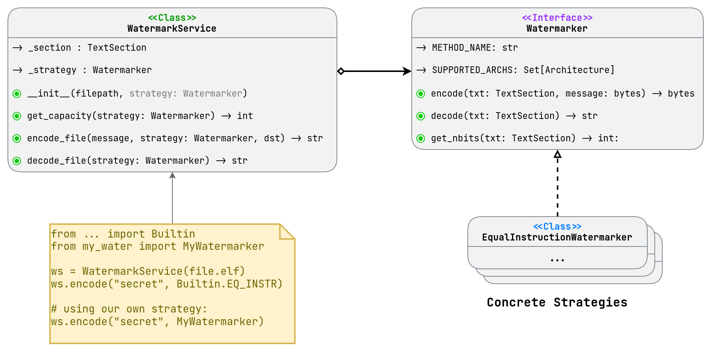

# Project Architecture

Project architecture is using extensible and maintainable design patterns to provide a clear and easy way to add new watermarking methods.

Diagram below shows the new architecture class diagram:

Old architecture and its flaws are described in the [Architecture Rework Report](./ArchRework.md).

## Main Design Decisions

### Strategy Pattern

Use of Strategy Pattern is obvious in our project, because we are aiming to provide multiple watermarking strategies and easy way to add new ones.

As a Context class we define `WatermarkService` class, which is responsible for managing the watermarking process and is the main entry point for the user to interact with.

### TextSection Object

### Layered Structure

### Extension Policy
