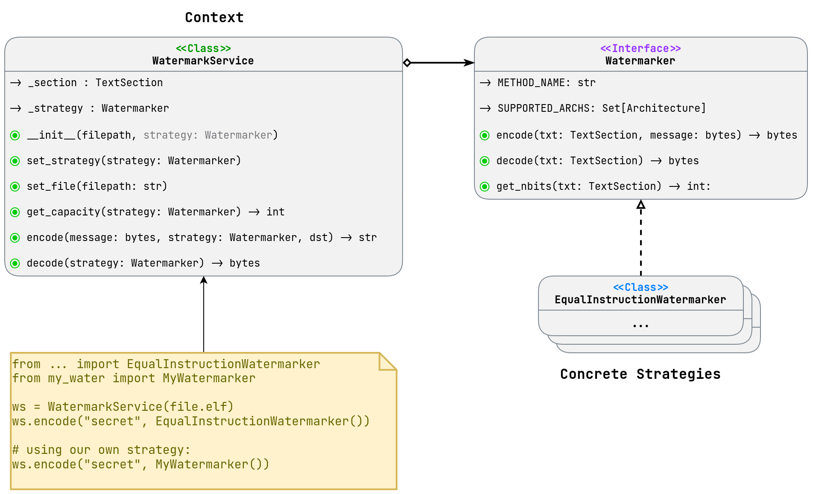

```text
THIS IS DRAFT DOCUMENT
Later it will be moved to the main documentation
```

# Project Architecture

Project architecture is using extensible and maintainable design patterns to provide a clear and easy way to add new watermarking methods.

Diagram below shows the architecture class diagram:


Old architecture and its flaws are described in the [Architecture Rework Report](./ArchRework.md).

Folder orgainization is as follows:

```text
watermark_framework/
├── architecture.py          # Defines Architecture enum (e.g., RISCV64, X86_64)
├── io/
│   ├── loader.py            # TextSectionHandler imports Architecture
│   └── writer.py
├── core/
│   └── service.py           # WatermarkService imports Architecture
└── watermarkers/
    ├── interface.py         # Watermarker interface uses Architecture
    └── eq_instr/
        ├── riscv.py         # Imports Architecture for RISCV64
        └── x86.py           # Imports Architecture for X86_64
```

# Main Design Decisions

## Strategy Pattern

Use of Strategy Pattern is obvious in our project, because we are aiming to provide multiple watermarking strategies and easy way to add new ones.

As a Context class we define `WatermarkService` class, which is responsible for managing the watermarking process and is the main entry point for the user to interact with.



### How we manage strategies

In the Strategy Pattern, the *Context* (in our case, `WatermarkService`) delegates the watermarking logic to a *Strategy* (implemented by classes adhering to the `Watermarker` interface).

This allows the framework to support multiple watermarking algorithms interchangeably, with the flexibility to add new strategies without modifying the core service.

We chose a model where the **user is responsible for initializing** concrete `Watermarker` implementations and passing these instances to `WatermarkService`.

This approach of passing instances instead of classes ensures maximum flexibility, as **users can configure strategies with custom parameters**.

> *For example*: configuring equivalent instructions for `EquivalentInstructionWatermarker`.

#### Strategy Instance Management

1. **Passing Instances to `encode()` and `decode()`**:
   - The `encode()` and `decode()` methods accept a `Watermarker` instance, which must implement the `Watermarker` interface.
   - Users can create and configure their own instances of `Watermarker` and pass them directly to these methods. Or use built-in strategies.
2. **Passing Instances to the Constructor**:
    - The `WatermarkService` constructor accepts an optional `Watermarker` instance, allowing users to set a default strategy at initialization.
3. **Dynamic Strategy and File Switching with `set_strategy()` and `set_file()`**:
   - To enhance usability, `WatermarkService` provides two setter methods:
     - `set_strategy(strategy: Watermarker)`: Updates the current strategy, validating that it’s a valid `Watermarker` instance and compatible with the loaded file’s architecture.
     - `set_file(path: str)`: Loads a new ELF file, updating the internal `TextSection` and ensuring compatibility with the current strategy (if set).

Examples with pseudo-python code that provides better understanding of used pattern:

### Use of builtin watermarker with default configuration

```python
from watermark_framework.core.service import WatermarkService
from watermark_framework.watermarkers import EquivalentInstructionWatermarker

svc = WatermarkService("example.elf")

patched = svc.encode("secret", EquivalentInstructionWatermarker())
print(f"Patched: {patched}")

svc.set_file(patched)

decoded = svc.decode(EquivalentInstructionWatermarker())
print(f"Decoded: {decoded}")
```

Example of **passing Watermarker instance to constructor**:

```python
from watermark_framework.core.service import WatermarkService
from watermark_framework.watermarkers import EquivalentInstructionWatermarker

svc = WatermarkService("example.elf", EquivalentInstructionWatermarker())

patched = svc.encode("secret")
print(f"Patched: {patched}")

svc.set_file(patched)

decoded = svc.decode()
print(f"Decoded: {decoded}")
```

**Changing the strategy** after initialization is also possible:

```python
from watermark_framework.core.service import WatermarkService
from watermark_framework.watermarkers import EquivalentInstructionWatermarker, StackWatermarker

svc = WatermarkService("example.elf", EquivalentInstructionWatermarker())

patched = svc.encode("secret")
print(f"Patched with eq_instr: {patched}")

svc.set_strategy(StackWatermarker())

patched_stack = svc.encode("secret")
print(f"Patched with stack watermarker: {patched_stack}")
```

### Use of builtin watermarker with custom configuration

Because we are passing to `encode()`/`decode()` instances of `Watermarker` class, we can easily configure them with custom parameters in constructor.

Such as configuring equivalent instructions for `EquivalentInstructionWatermarker`:

```python
from watermark_framework.core.service import WatermarkService
from watermark_framework.watermarkers import EquivalentInstructionWatermarker

svc = WatermarkService("example.elf")

equiv_insns = [
    (..., ...)
    (..., ...),
    ...
]
custom_strategy = EquivalentInstructionWatermarker(equivalent_instructions=equiv_insns)

patched = svc.encode("secret", custom_strategy)

svc.set_file(patched)
decoded = svc.decode(custom_strategy)
```

### Use of custom watermarker

```python
from my_watermarker import MyCustomWatermarker

svc = WatermarkService("example.elf")

patched = svc.encode("secret", MyCustomWatermarker())
print(f"Patched: {patched}")
```

## TextSection Object

The `TextSection` object is a structured data container that holds all the essential information about the `.text` section of an ELF binary.

This is overview of our small `IO/Disassembly` layer:


The `TextSectionHandler` is a utility class with such responsibilities:

- Loading the `TextSection`:
  - Reads the ELF file and extracts the .text section's data and metadata.
  - Detects the binary's architecture and configures Capstone for disassembly.
  - Creates and returns a populated `TextSection` object.
- Writing the Modified file:
  - Takes the modified .text section data and patches it back into a new ELF file at the correct offset.
  - Preserves the rest of the original file structure.

Overview of the `TextSection` fields:

| Field      | Type            | Description |
|------------|-----------------|-------------|
| `data`     | `bytes`         | The raw byte content of the `.text` section.|
| `insns`    | `List[CsInsn]`  | A list of disassembled instructions, where each instruction is a Capstone `CsInsn` object. |
| `vma`      | `int`           | The Virtual Memory Address (VMA) where the `.text` section is loaded in memory during execution.|
| `offset`   | `int`           | The file offset where the `.text` section begins in the ELF binary. Used when patching the file with modified data.|
| `size`     | `int`           | The size of the `.text` section in bytes. |
| `arch`     | `Architecture`  | The architecture of the binary (e.g., RISC-V 64-bit, RISC-V 32-bit), represented as an enum.|
| `src_path` | `str`           | The file path of the original ELF binary, stored for reference during file writing operations.|

## Support for Multiple Architectures

Our team decided to add support for multiple architectures, because we are aiming to provide a generic solution that can be used on different platforms.  

Key player in this is the `TextSectionHandler` class, which is responsible for detecting the architecture and configuring Capstone for disassembly.

Additionally, we define at top level an `Architecture` enum that provides a clear and easy way to identify the architecture of the binary.


Each member of `Architecture` Enum defines metadata for an architecture, including its name, Capstone disassembler constants, and ELF header identifiers.

> The `e_machine` and `elf_class` fields are primarily used internally by `from_elf` to map ELF headers to architectures, but are public for debugging or advanced use cases.

| Attribute        | Type           | Description |
|------------------|----------------|-------------|
| `name`           | `str`          | Human-readable architecture name (e.g., "riscv64").|
| `capstone_arch`  | `int`          | Capstone architecture constant (e.g., `CS_ARCH_RISCV`).|
| `capstone_mode`  | `int`          | Capstone mode constant (e.g., `CS_MODE_RISCV64`).|
| `e_machine`      | `int`          | ELF machine type (e.g., `EM_RISCV`).|
| `elf_class`      | `Optional[int]`| ELF class (32 or 64) or `None` if not applicable.|

Each Watermarker implementation is responsible for providing its supported architecture in the `SUPPORTED_ARCHS` field.

```python
    SUPPORTED_ARCHS = { Architecture.RISCV64, Architecture.X86_64 }
```

## Extension Policy

The Watermark framework is designed to be easily extensible, allowing users and developers to add new watermarking strategies without modifying the core codebase.

We’ve defined a clear policy for extending the framework with new `Watermarker` implementations, aiming for two primary audiences:

- End users installing the library via pip
- Developers contributing to the framework’s repository.

### Extension for End Users (pip installation)

For users who install the Watermark framework via pip, the primary way to extend the framework is by creating a custom `Watermarker` implementation and passing an instance of it to `WatermarkService`.

This approach is straightforward and doesn’t require modifying the library’s code:

1. **Create a Custom Watermarker**:
   - Users implement a new class that inherits from the `Watermarker` interface (defined in `watermark_framework.watermarkers.interface`).
   - The class must implement the required methods (`get_nbits()`, `encode()`, `decode()`) and define `SUPPORTED_ARCHS` to specify compatible architectures (e.g., `Architecture.RISCV64`).

2. **Use the Custom Watermarker**:
   - Users instantiate their custom Watermarker and pass it to WatermarkService’s `encode()`, `decode()`, or `set_strategy()` methods, or provide it to the constructor.

### Extension for Framework Developers (Repository Contributors)

For developers contributing to the Watermark framework (e.g., those working with the full repository), the process for adding new built-in strategies is more structured to ensure consistency and maintainability:

1. **Create a New Watermarker Class**:
   - Developers create a new class in the `watermark_framework/watermarkers` directory, following the naming convention of existing classes (e.g., `MyCustomWatermarker`).
   - Implement the class, ensuring it inherits from `Watermarker` and defines all required methods and `SUPPORTED_ARCHS` with `NAME`.

2. **Export the New Watermarker**:
   - Export the new strategy in `watermark_framework/watermarkers/__init__.py` to make it accessible to users:

   ```python
   from .new_strategy import NewWatermarker
   ```

3. **Update Documentation**:
   - Document the new strategy in the framework’s documentation, including its purpose, configuration options, and example usage.
   - `TODO:` link
